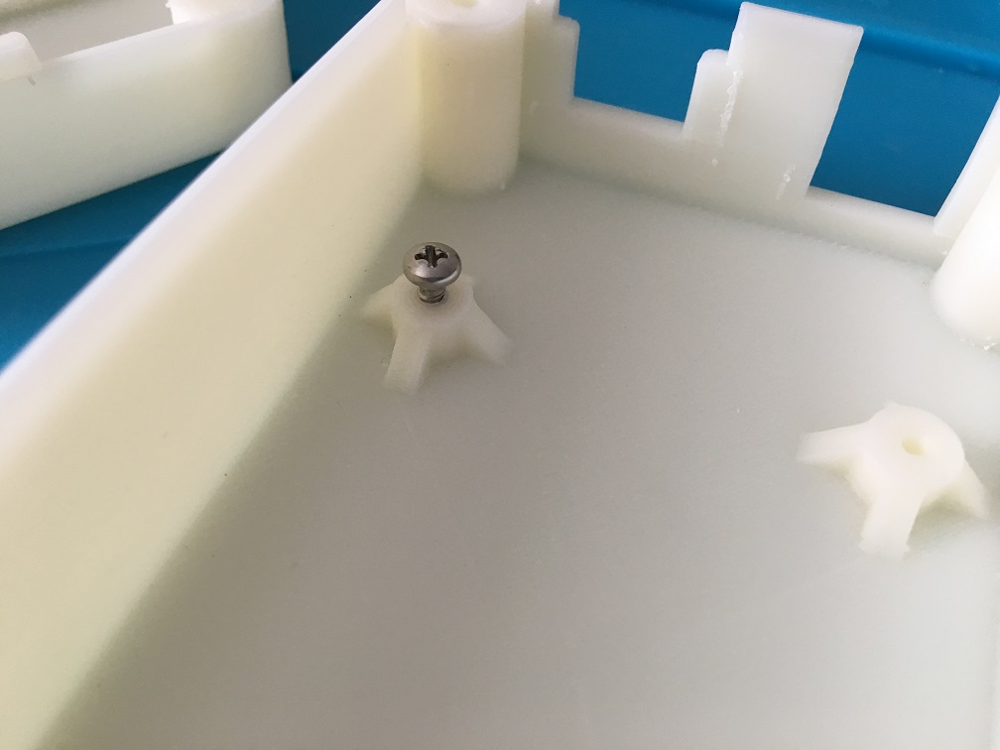
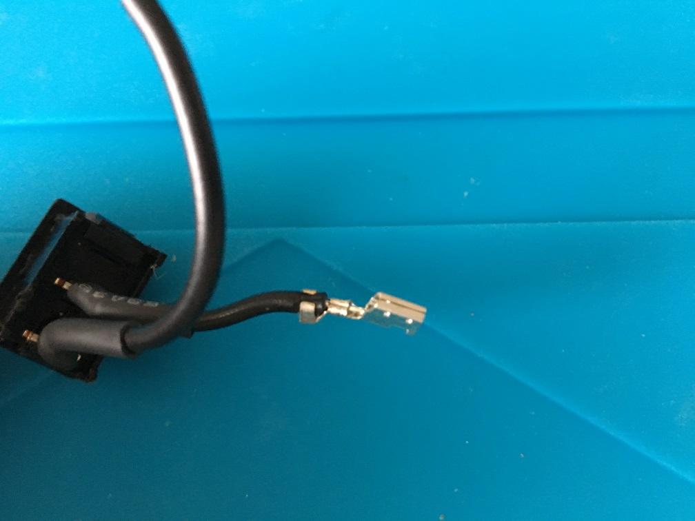
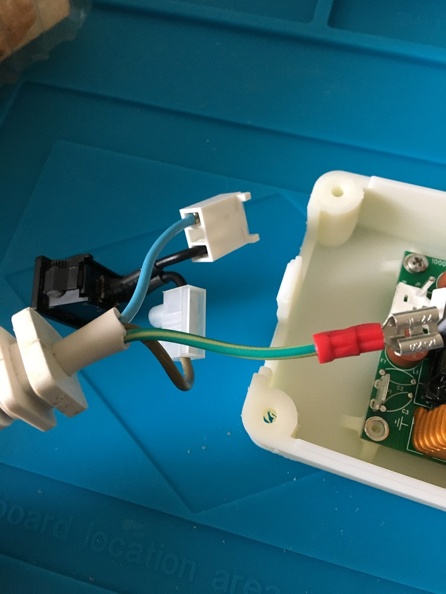
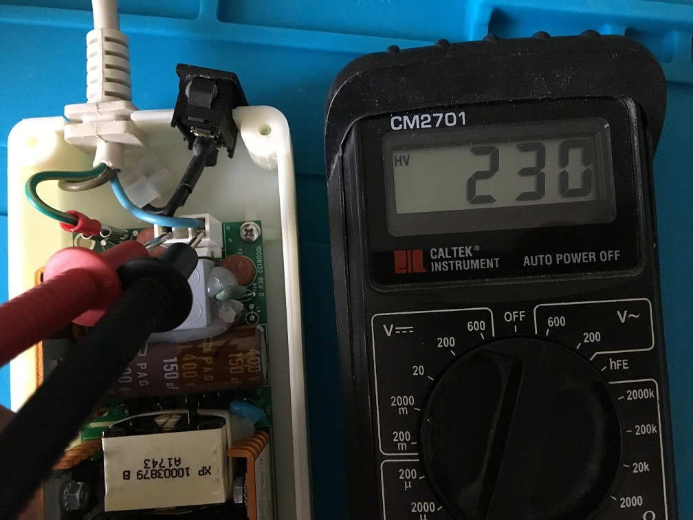
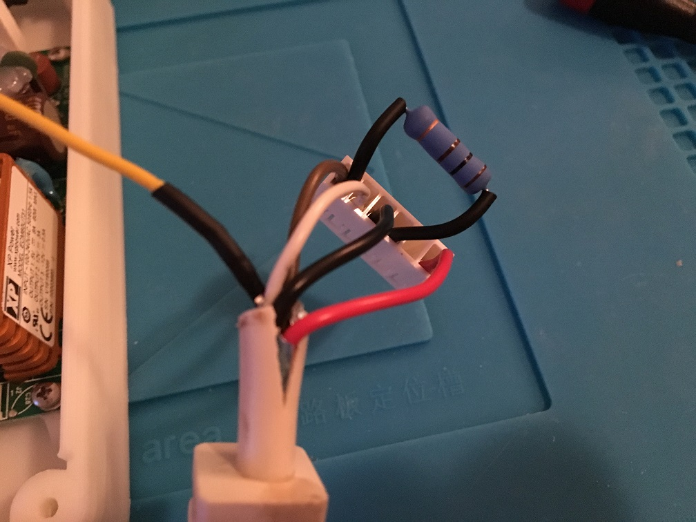
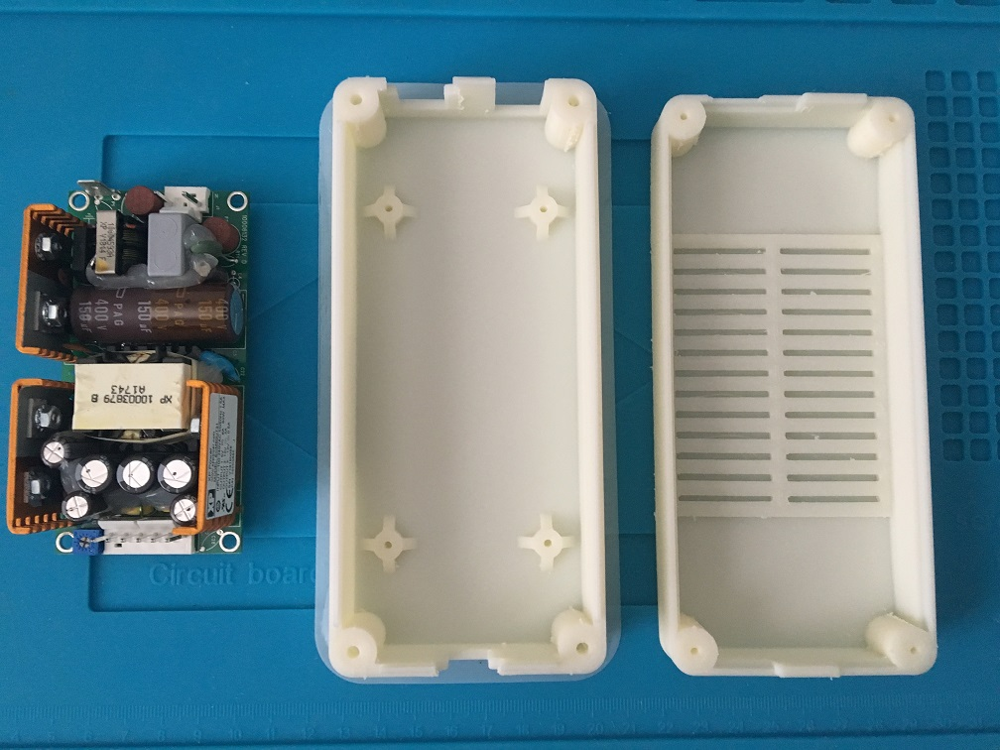
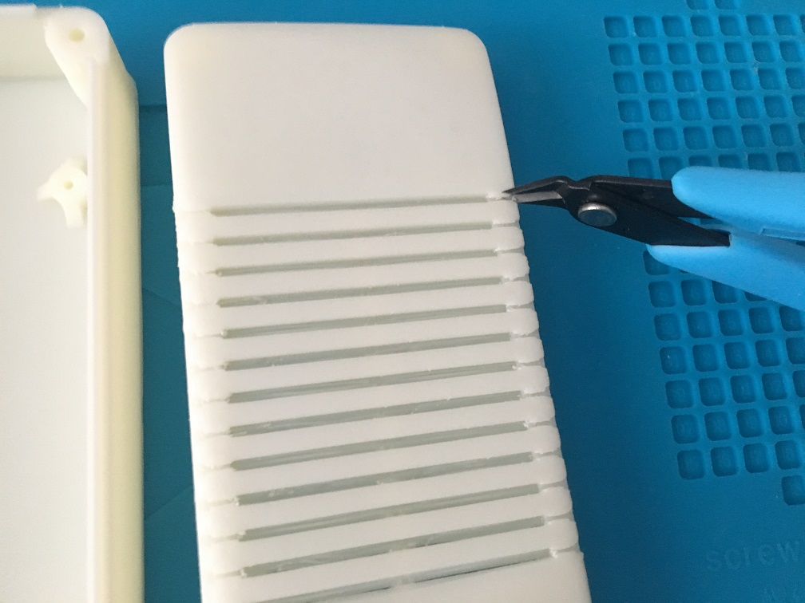

# Amiga PSU Enclosure for XP Power ECM60UT31
A 3d-printable Amiga PSU enclosure for the XP Power ECM60UT31 PSU

3d-model is created in DesignSpark Mechanical 4.0

 

***

For 3d-printing scroll further down!

Cabling is taken from an old dead Amiga 600 PSU. Also the power switch is reused and a power resistor is added to put a dummy load of just above 100mA on the +12V rail to satisfy the minimum load requirements stated in the <a href="https://www.xppower.com/portals/0/pdfs/SF_ECM40-100.pdf">datasheet</a> for the XP Power ECM60UT31 PSU.

***

Attention: Read the <a href="LEGAL_DISCLAIMER.md">Legal Disclaimer</a> before doing any electrical work yourself.

***

First, fit the PSU into the case and secure it with three screws. Leave the top left screw undone for now, the shielding wire will be connected to this screw hole as it shares to common GND shielding. I didn't have screws with correct height (~5-6mm) so I used a hacksaw on some longer ones...

 

 

</a>

***

Starting with the Power cord side, measure, cut, strip and prepare the wires for crimping...

* Brown: Line
* Blue: Neutral
* Green/Yellow: GND

 

***

Now crimp and fit the wires into the connection socket and housing. Make sure to push all the way down until it clicks into position...

 

***

Now we can plug it in and check voltages

AC:
 

 
DC:
 

***

### Dummy load

The Amiga almost exclusively use the +5V rail so no problem there but on +12V we might need to put a dummy load on. Checking the specs we see that ECM60UT31 has a minimum current requirement of 0.1A on the +12V output. Let's calculate Ohm and Wattage to pick a suitable resistor. This can easily be done manually or by using a online-calculator like this one: https://www.rapidtables.com/calc/electric/watt-volt-amp-calculator.html

We see that using a 100 Ohm resistor with a tolerance of 3 watt is a perfect fit here giving us a 120 mA dummy load 1.44W well under the tolerance level of the resistor. The energy will dissipate as heat.

***

Applying theory in practice:

Checking the ampere's with a multimeter...shows 118.8mA, very close to what was excpected (120mA)! 

***

Now, let's do the cabling for the other side of the PSU, but first switch off and disconnect power cord from outlet.

measure, cut, strip and prepare the wires for crimping.

* Yellow = GND/Shield/Earth
* White = -12V
* Brown = +12V
* Red = +5V
* Black = 0V/Signal GND

We extend the shielding with a yellow wire, crimping and some shrink tube over it. I put some shrink tube on the resistors legs for safety reasons. Now fit the yellow shielding wire around the last screw and screw it in place and plug the connector in.

***

With everything in place now plug in the Power cord and turn the power switch on. Now, verify the square connector is correctly connected, and also check for continuity for the shielding.

 
***

Putting it together

When I were to fit top and bottom parts together I discovered I had to chip off some material on the top part and use the rasp to make the power switch hole a little higher. I took the dimensions from the <a href="https://github.com/jbilander/AmigaPSU_Enclosure_for_Mean_Well_RT-50B">A500 PSU model </a> and the A600 cable is evidently a little different in size compared to that one. Anyway, no big deal.

***

And here it is among friends, the two at the back are "lightweight" versions and still going strong...

***

### 3d-printing

I printed in ABS-plastic since it feels a lot more safe dealing with power and heat compared to PLA.

### Printing the top part.

Settings: Nozzle 250° C, Bed 120° C, Infill 60%. Printing time: 9 hours! with Ender 3-Pro and using the hairspray trick to make the material stick to the polypropylen bed.

 

***

In the middle of the print the corners started to come off, I didn't print with a brim but the corner creep only improved on the design a little :)

***

### Printing the bottom part

Using similar settings here but printing with a brim to make it stay more flat. 9 hours for this print to finish. I used tape on the brim fringe to make it stick to the bed better.

 

***

Using a hacksaw and a wire cutter to trim the design of the vent.

 

***

I got a small crack in the case body during cooling, I used some superglue to seal it...

***

The final result once again:
 

